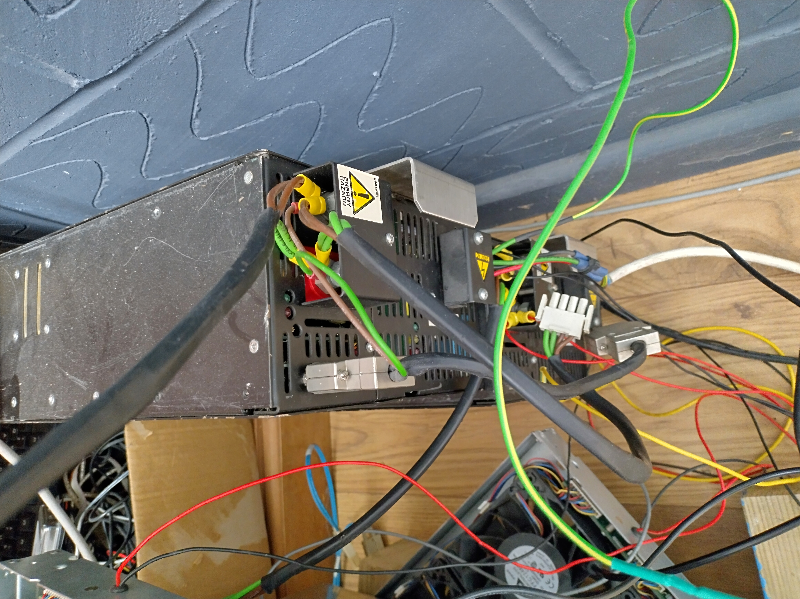
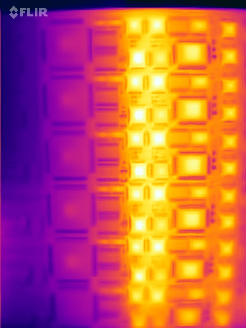

# Whitecross WX9020

# Background
Back in ~2006 I rescued the guts of a Whitecross WX9090 data mining system. By guts I mean power supplies, armfulls of fiber optic interconnect and all the sub racks. It was for sale by a recycler who wanted it gone, and we made a deal that I could spend a few hours dismantling and take whatever I wanted. What was left would go to scrap (which was the racks and all the ancillary bits - batteries, power control boards, sensors, fans, etc).

Following a post on comp.sys.transputer, the CTO of Whitecross kindly reached out and supplied two of the specially configured SPARC workstations that were used as the operators console. They also very kindly supplied much technical documentation including some schematics, test software, etc. The operator workstations were also useable and contained system diagnostics.

## Chassis
The WX9020 originally was one or more 19" cabinets. A cabinet had a UPS in the base and a huge extractor fan in the top. In between these are multiple 6U sub racks. Each sub rack has a specific purpose - system control, storage or compute.

## Power
Each sub rack has a 48V power inlet and earth stud. 48V is supplied courtesy of huge Advance power supplies (~4kW). Each card in the rack has independent power supplies fed from the 48V feed. Most cards use +5V, -5.2V (for the ECL converters) and the storage sub racks also use 12V for the disks. Along with the rest of the system the power systems are extremely well built and all the power modules are carrier grade devices.

Here's 2 of the PSUs powering my current dev setup. These also power the Cisco fan trays that I use for cooling - these aren't quite a full 19" width so are positioned diagonally under each rack to provide maximum coverage - especially to the PSU & ECL areas that get hottest!

## Interconnect
The sub racks are interconnected with fiber pairs using High Speed Link (HSL) cards in a daisy chain fashion to form a continuous loop (the only copper connections to a sub rack are for power). The HSL cards multiplex 6 transputer links and 8 system control signals onto a 120Mbps fiber link.

Each Transputer in the system is connected via ECL links onto the sub rack backplane. Since each Transputer has 4 links, and each link is a pair, and each ECL signal is a differential pair, that's 16 backplane signals per Transputer!

Each card uses a huge Siemens quad width connector with 6 power pins in the middle. The HSL and processor cards have 192 backplane signals (3*2*32) whilst the SC uses all 256 signals

Along with the links, the HSL also carries the regular Transputer Reset, Analyse and Error signals and Whitecross specific signals, such as byte mode which places all HSL cards into byte mode. Normally, the HSLs transfer 16 bit words, but in order run things like ispy, the system is placed into byte mode. 

Each HSL card has 2 identical, independent HSL units. Each unit has a pair of T225 Transputers, booted from a local ROM, some buffer and a Tx/Rx 125Mbit fiber interface. The T225s just provide the HSL function and don't form part of the Transputer network. 

### HSL front

### HSL back 

### HSL in rack (with the fiber)

# System controller card
A system controller sub rack has 2 compute cards, 2 HSL cards and a system controller (SC) card. As you'd expect, the SC provides overall management of the rack. It interfaces to the rack power and environmental controls, the front panel console and the operators workstation (using a dedicated fiber link). A redundant system will duplicate all these cards with their own 48V supply.

The SC uses a T225 to communicate with the operators workstation, a T222 for boot and system monitoring and the root T425 in the Transputer network.

## Replacement
Sadly whilst in storage the on-board battery leaked acid everywhere and destroyed much of the system controller cards. One was useable, but due to these factors:
- Having a single useable SC card is obviously a weak link
- The host (operator workstation) link was 10Mbps
- 90% of the cards functions aren't used (temperature sensor interfaces, etc)
- No schematics or firmware source

Replacement was a sensible choice. Since I had schematics for the other cards in the rack (SCL & processor) I was able to reverse engineer the important signals generated by the SC card. Mostly these are 2 links from the T425 and generation of reset, analyse and byte mode signals. There's also Whitecross specific signals, e.g. to disable the transmitters on one HSL card to allow the signals to be driven by the SC card. It was also an opportunity to provide standard TRAM sockets, for example to carry an Inmos B438 frame buffer card, so I can render the Mandelbrot set directly to an attached display ;)

The replacement SCL is named SCL4 (since the Whitecross card is SCL3) and has had a couple of revisions. SCL4 uses components removed from dead SCL3s, including the power bricks and the (impossible to find new) 256+6 Siemens backplane connector.

### 1st attempt

This first attempt worked, but had some ugly hacks (the -5V brick signals were inverted and I was missing some control signals)

### Next atempt
Here's the 2nd attempt mounted in the system controller subrack with B438 populated. The 5V power brick provides a nice place for scribbles :)

The SCL4 connects to my own host adapter. In v1.0 I used pin headers but these are generally not reliable so in v1.1 I swapped to a pair of RJ45 connectors - one for links, the other for control (reset, analyse, error, byte mode, clock, etc).

All of the logic on the board is TTL/ECL conversion.

Even this version isn't quite right - the power and error LEDs are mirrored and since the RJ45 connectors aren't mounted on the board edge removing the plugs is tricky! Given the effort to remove the massive Siemens edge connector from an original SCL3 this is probably the last SCL4 revision!

The SCL4 design is here https://github.com/machineroom/SCL4

### Host adapter
My host adapter ("*PIMOS*") uses a Raspberry Pi4 and C011 on a board of my design. It uses pin headers for the target link but a future re-spin will use the same RJ45 connectors as the SCL4 card. The design and code ie here https://github.com/machineroom/rpi_c011. Currently I'm using a cut down SCL4 card (I have spares since the fab order is minimum 5!) to provide the host adapter end of the RJ45 pair. It's a bit ugly...

# Processor card
This is what makes the WX9020 interesting!

Here's the card front, showing the major components. There are 6 identical compute units, each with a 25MHz T425, an ECC controller and 16MB RAM. Each compute unit also has a pair of ECL/TTL converters for connection to the backplane. There are no direct links between the compute nodes on a card. Each compute unit is fused with a pair of fuses from the on-board PSUs.

There's also a card ID generator so individual Transputers can read the card ID and their position. The front edge LEDs indicate +5V good, -5.2V good and Error for each compute unit and 48V card power good.

The back has support circuitry, including the clock generator and remaining 8MB half of the RAM.

A fully populated processor sub-rack (19 PROC cards, 114 Transputers & 1824MB RAM!), with 2 HSL cards

## Fuse woes
What are the red flecks on the card edges? I'm glad you asked... as mentioned above, each compute unit is protected with a pair of SMT fuses. The -5.2V fuse (1A) has an odd failure mode where it'll drop out, then recover. These drop out periods are anything from a few ms (so only visible on a scope) to seconds (obvious from the front edge LED blinking). Since this affects the links it can lead to really odd issues! The only solution is to replace all the fuses :( I've managed to find NOS devices since these aren't a standard size. So far this is proving reliable and as each card is fixed I mark it!

## Power
So how much power does all this draw? Lots! 

As you can see from the thermal, things get pretty hot. The ECC controller and RAM are pretty cool, but the FPGAs, T425 and ECL/TTL all glow! A full populated processor sub-rack draws ~1.7kW.

